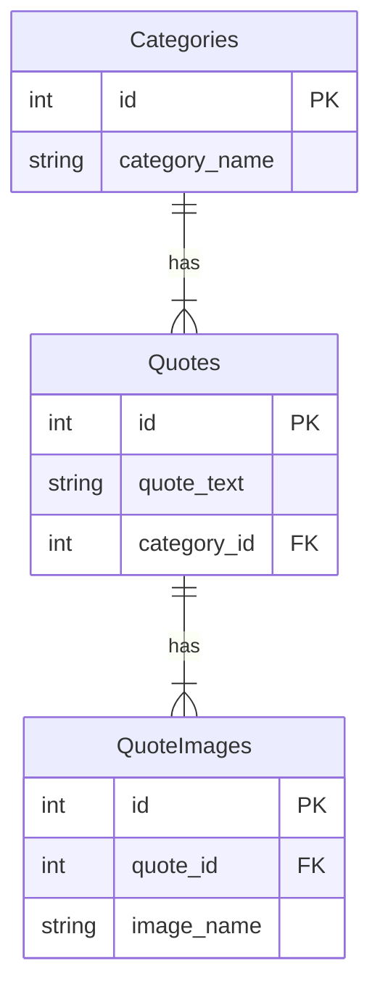

# Exam

## Functional requirements for the API:

1. Create a database with shown diagram.
2. Upload multiple images for a quote.
3. Edit/change a quote's author, quote text, or category.
4. Add Quote Image by quote id
5. Delete a quote by ID.
6. Get all quotes with the number of images.
7. Get all quotes belonging to a specific category.
8. Get a random quote from a specific category.
9. Upload image files into the wwwroot/images/posts directory.

After testing and finishing methods

- create a private repository in https://github.com/softclub-csharp-0-8 organization
- name your project with this format `[kabilov_chori_exam_3.06.2023]`
